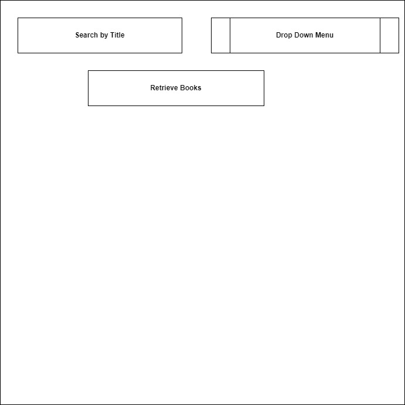
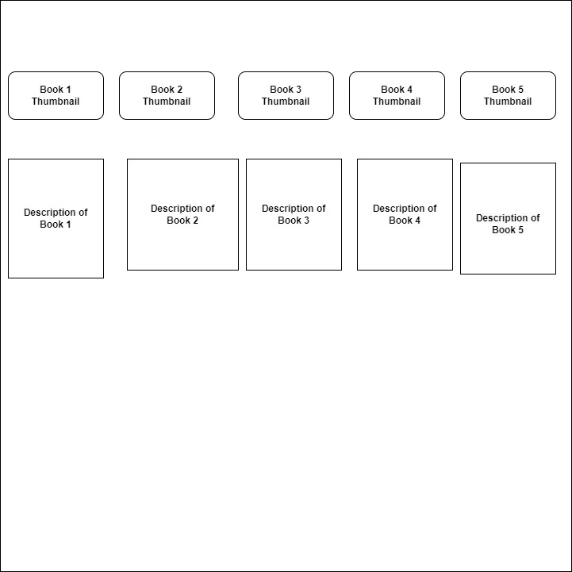

# Book-Search-Project-Mod2

# Live Link
https://superlative-selkie-711c69.netlify.app

# Description:
I used HTML, CSS, JavaScript, React to build my MOD2 Project
I enjoyed the journey. My daughter is my inspiration to make this project. She loves reading so I decided to make my APP with Google Books API to display free-ebooks.
I used the endpoint text search to get the data from the API.
I used useEffect to render books from the array randomly.
I used State to insert the data retrieved and display it on the screen.

1. Is an API key required?
   No, API key is not required

2. Base URL 
   https://www.googleapis.com/books/v1/volumes?maxResults=25&filter=free-ebooks&lr=lang_en 

3. What is one endpoint that you could use in the api?
    https://www.googleapis.com/books/v1/volumes?maxResults=25&filter=free-ebooks&lr=lang_en&q=+intitle:css 

# Wireframe

# Challenges

## 1. When I used the parameter langRestrict="en" it is still giving me the other language books. I am still working on it.

## 2. The other challenge I faced when building this APP was when I used the parameter filter=paid-ebooks. When I used this parameter it was giving me the expected output, but when I click the link to get the book it is automatically attaching my paypal details that I saved on my system so I didnt' use the parameter. 

## 3. I want to still work on styling and building a multiple page application

## Parameters I used in this API:

### MaxResults = 25
#### (For any request for all items in a collection, you can paginate results by specifying startIndex and maxResults in the parameters for the request.)

### filter: filter=free-ebooks
#### (filter=free-ebooks - Restrict results to free Google eBooks)

### langRestrict="en"
  #### (Restrict the search results to those with a certain language by specifying langRestrict to a two-letter ISO-639-1 code, such as "en" or "fr".)

### q=+inititle:
#### (intitle: Returns results where the text following this keyword is found in the title.)

# Resources I used 

## Google Books: https://developers.google.com/books/
## TA Iya

This template provides a minimal setup to get React working in Vite with HMR and some ESLint rules.

Currently, two official plugins are available:

- [@vitejs/plugin-react](https://github.com/vitejs/vite-plugin-react/blob/main/packages/plugin-react/README.md) uses [Babel](https://babeljs.io/) for Fast Refresh
- [@vitejs/plugin-react-swc](https://github.com/vitejs/vite-plugin-react-swc) uses [SWC](https://swc.rs/) for Fast Refresh
# Google-Book-Search-Project
